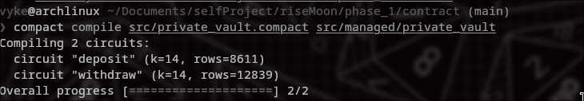
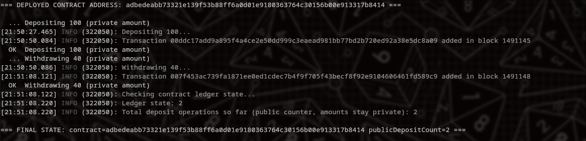

# Private Vault

A Midnight "New Moon" Level 1 submission: a Compact smart contract that lets
users deposit and withdraw funds while keeping their balance and transaction
amounts completely private. Only a ZK commitment (a hash) and a public
deposit counter ever touch the ledger - no address, identity, or amount is
ever stored in the clear.

## The idea

Public blockchains expose every balance and transfer to anyone watching the
chain. Private Vault demonstrates how Midnight's Compact language and ZK
circuits can hide the sensitive part (how much you hold, how much you moved)
while still letting the chain enforce correctness (you can't withdraw more
than you deposited, you can't forge someone else's balance). A user proves,
in zero-knowledge, that they know a secret key and that their claimed balance
matches a commitment already on the ledger - without revealing the secret key
or the balance itself.

## Public ledger state vs. private witness

The contract (`contract/src/private_vault.compact`) splits state into two
worlds:

**Public ledger state** (visible to everyone, stored on-chain):
- `balances: Map<Bytes<32>, Bytes<32>>` - maps a public key commitment to a
  balance commitment. Both are hashes; neither reveals the underlying secret
  key or amount.
- `depositCount: Counter` - a running count of deposit operations. Anyone can
  see *how many* deposits have happened, but not by whom or for how much.

**Private witness** (never transmitted, lives only in the user's local
wallet state):
- `localSecretKey(): Bytes<32>` - the user's private key, used to derive
  their public key commitment inside the circuit.
- `localBalance(): Uint<64>` - the user's current private balance.

The `deposit` and `withdraw` circuits read the private witnesses, compute
new commitments with `persistentHash`, and only `disclose()` the resulting
hashes to the public ledger - the secret key and the plaintext amount never
leave the witness layer. `withdraw` additionally asserts the caller's claimed
balance commitment matches what's already on-chain before allowing a debit,
which is what stops a user from withdrawing funds they never deposited.

## Project layout

```
contract/   Compact contract source, compiled ZK circuit artifacts, witnesses
cli/        Node/TypeScript CLI + scripted demo for deploying and exercising the contract
```

## Setup

Requirements: Node.js 20+, Docker (for the local proof server), and the
[Compact compiler](https://docs.midnight.network/) if you want to recompile
the contract yourself.

```bash
npm install                 # installs workspace deps (contract + cli)
npm run build --workspace=contract   # compiles the TypeScript wrapper around the ZK artifacts
```

Start the local proof server (required for generating ZK proofs against a
live network):

```bash
cd cli
docker compose -f proof-server.yml up -d
```

## Running the deploy demo

The demo script restores a wallet from a fixed hex seed, waits for it to be
funded, deploys the contract, performs a deposit and a partial withdrawal,
and prints the deployed contract address and final ledger state.

```bash
cd cli
npx tsx src/deploy-demo.ts <hex-seed>
```

Fund the wallet's printed unshielded address from the Midnight Preview
faucet (https://faucet.preview.midnight.network/) once it's shown, then let
the script run - it polls until funds arrive and proceeds automatically.

### Deployed instance (Preview testnet)

```
Contract address: adbedeabb73321e139f53b88ff6a0d01e9180363764c30156b00e913317b8414
Network:          Preview
```

## Screenshots

Compact circuit compilation:



Contract deployed on Preview, with a deposit and a partial withdrawal:


